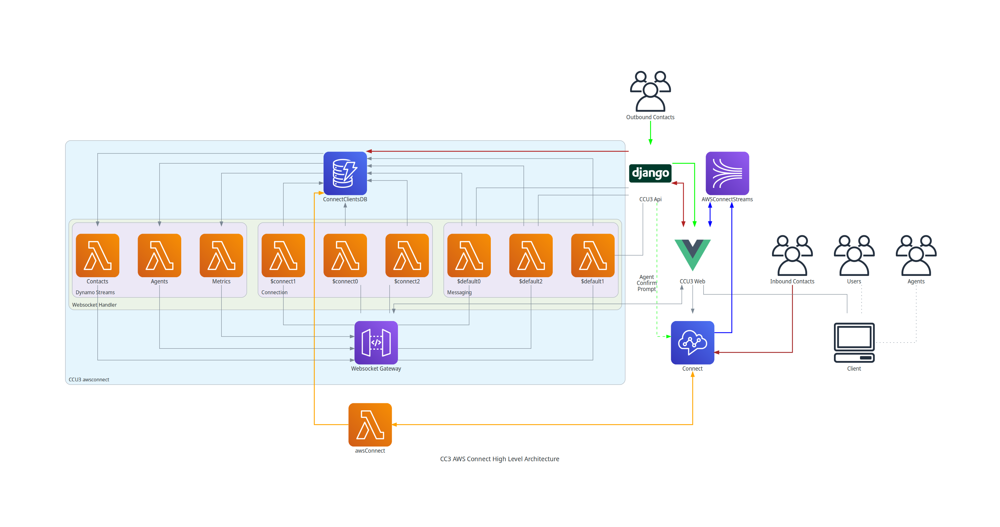

# Crisis Cleanup - AWS Connect

Crisis Cleanup is a collaboration platform that connects disaster recovery organization volunteers with people who need help after a disaster. The Crisis Cleanup platform has been used to connected 631,620 volunteers from 1,704 organizations with 80,905 households in 48 states/provinces and 143 disasters in 7 countries; a new disaster every two weeks.

Crisis Cleanup works best in a collaborative environment where multiple voluntary organizations and agencies work together and coordinate efforts. Because these organizations do not take orders from one another, Crisis Cleanup is designed to facilitate Collaborative Accountability models of inter-agency interaction, rather than command-and-control operations, or or heirarchical accountability models of interaction. 

# AWS Connect Integration

This repository hosts Crisis Cleanup's lambda integrations with AWS Connect.

## High Level Architecture

Visual overview of critical communication paths.

